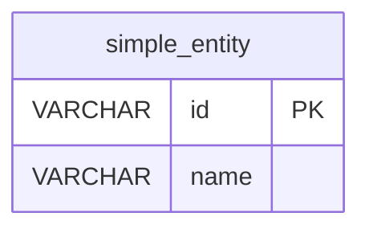
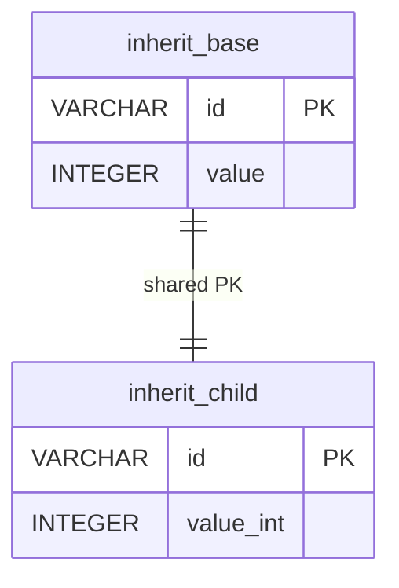

# fluid-jdbc

[)](https://github.com/david-auk/fluid-jdbc/actions/workflows/tests-pinned.yml?query=branch%3Amain)
[)](https://github.com/david-auk/fluid-jdbc/actions/workflows/tests-latest.yml?query=branch%3Amain)
[](https://central.sonatype.com/artifact/io.github.david-auk/fluid-jdbc)
[](https://github.com/david-auk/fluid-jdbc/blob/main/LICENSE)

`fluid-jdbc` is a small Java/JDBC helper that lets you:

- Map Java classes/records to database tables using annotations.
- Generate a generic `Dao<T, PK>` for CRUD operations.
- Model **foreign keys** (optionally hydrated on read).
- Model **table inheritance** (child table shares the same PK and references the base).

> This library is intentionally lightweight: it does not try to be a full ORM.

## Install

### Gradle (Kotlin DSL)

```kotlin
repositories { mavenCentral() }
dependencies { implementation("io.github.david-auk:fluid-jdbc:0.1.3") }
```

## Quickstart (minimal example)

This section shows the smallest possible setup to understand how `fluid-jdbc` works.

### 1) Create a simple table



Or:

```sql
CREATE TABLE simple_entity (
    id VARCHAR(255) PRIMARY KEY,
    name VARCHAR(255) NOT NULL
);
```

### 2) Map it to a Java entity

```java
@TableName("simple_entity")
public record SimpleEntity(
        @PrimaryKey @TableColumn String id,
        @TableColumn String name
) implements TableEntity {

    @TableConstructor
    public SimpleEntity(String id, String name) {
        this.id = java.util.Objects.requireNonNull(id);
        this.name = java.util.Objects.requireNonNull(name);
    }
}
```

> Tip: Validate your entity to see if your Entity is correctly annotated using:
> ```java
> TableEntity.validateEntity(YourEntity);
> ```

### 3) Use a DAO

More info about how to use a `Dao` [Here](#dao)

```java
try (Dao<SimpleEntity, String> dao = DAOFactory.createDAO(SimpleEntity.class)) {
    dao.add(new SimpleEntity("1", "hello"));

    SimpleEntity read = dao.get("1");
    System.out.println(read.name());
}
```

---

### Configuring your Database

`fluid-jdbc` ships with a small `Database` utility that resolves datasource settings **at call time** and then opens a new JDBC `Connection`.

#### Tested Databases

* Postgres ([pinned](./src/test/resources/image-versions/postgres/pinned.txt) & [latest](./src/test/resources/image-versions/postgres/latest.txt))
* MySQL ([pinned](./src/test/resources/image-versions/mysql/pinned.txt) & [latest](./src/test/resources/image-versions/mysql/latest.txt))

 > These are the container versions unit tests are preformed [Status of tests](https://github.com/david-auk/fluid-jdbc/actions) 

#### Resolution order (highest → lowest)

When you call `Database.getConnection()` it resolves config in this precedence order:

1. **Java System properties**
2. **Environment variables**
3. **`datasource.properties` on the classpath** (lowest precedence, loaded once)

Concretely, it reads:

| Setting | System property | Environment variable | `datasource.properties` key |
|---|---|---|---|
| URL | `datasource.url` | `DATASOURCE_URL` | `datasource.url` |
| Username | `datasource.username` | `DATASOURCE_USERNAME` | `datasource.username` |
| Password | `datasource.password` | `DATASOURCE_PASSWORD` | `datasource.password` |

If **URL** or **username** is missing/blank after resolution, it throws an `IllegalStateException`. Password may be omitted depending on your DB setup.

### Option A: System properties (highest precedence)

Useful for tests (e.g. Testcontainers) and CI where you want to inject settings per run.

Example:

```bash
java \
  -Ddatasource.url="jdbc:postgresql://localhost:5432/mydb" \
  -Ddatasource.username="myuser" \
  -Ddatasource.password="secret" \
  -jar app.jar
```

### Option B: Environment variables

Use these names (note: **DATASOURCE_***, not DB_* or fluid.jdbc.*):

- `DATASOURCE_URL` (e.g. `jdbc:postgresql://localhost:5432/mydb`)
- `DATASOURCE_USERNAME`
- `DATASOURCE_PASSWORD`

Example:

```bash
export DATASOURCE_URL="jdbc:postgresql://localhost:5432/mydb"
export DATASOURCE_USERNAME="myuser"
export DATASOURCE_PASSWORD="secret"
```

### Option C: `datasource.properties` (classpath fallback)

Create a file named **`datasource.properties`** and ensure it’s available on the runtime classpath (e.g. `src/main/resources/datasource.properties`).

Example:

```properties
datasource.url=jdbc:postgresql://localhost:5432/mydb
datasource.username=myuser
datasource.password=secret
```

This is treated as the **lowest precedence** and is handy for local development defaults.

### Using `Database`

Two entry points:

```java
// 1) Fully explicit:
Connection connection = Database.getConnection(url, user, password);

// 2) Resolved from props/env/classpath (best practice):
Connection connection = Database.getConnection();
```

#### Testing note (important)

`Database` intentionally **does not cache** the resolved URL/username/password in static finals. It re-reads **System properties on each call** so multiple test classes in the same JVM can point to different databases (common when running multiple Testcontainers-backed tests).

## How fluid-jdbc works (logic overview)

At a high level, the library does three things:

1. **Reads annotations** on your entity class.
2. **Builds a table mapping** (columns, primary key, foreign keys, inheritance).
3. **Generates a DAO** that performs JDBC CRUD operations based on that mapping.

You provide:
- A class implementing `TableEntity`
- Annotation metadata
- A database connection (directly or via `DAOFactory`)

The library handles:
- SQL generation
- Mapping ResultSets → entities
- CRUD operations
- FK handling
- Inheritance handling

---

## Annotations explained

### `@TableName`

Defines the database table name.

```java
@TableName("users")
```

Required for every entity.

### `@PrimaryKey`

Marks the primary key.

Can be:

- On a field (must also have `@TableColumn`)
- On a **no-arg method** returning the PK value

Only one primary key is allowed per entity.

### `@TableColumn`

Marks a field as persisted.

```java
@TableColumn(name = "value_int")
Integer value;
```

Notes:
- Optional `name` overrides column name
- Must not be a primitive type (use `Integer`, `Long`, etc.)

### `@TableConstructor`

Marks the constructor used when hydrating entities from the database.

Exactly one required per entity.

### `@ForeignKey`

Marks a field as a foreign key.

Requirements:
- Field type must implement `TableEntity`
- Column references the PK of the foreign table

### `@TableInherits`

Declares table inheritance.

```java
@TableInherits(BaseEntity.class)
```

Rules:
- Entity must actually `extends BaseEntity`
- PK may be defined on the base class

---

## Dao and DaoTransactional

### Dao

`Dao<TE, PK>` is a generic, `AutoCloseable` CRUD abstraction.

`TE` = The entity implementing marker interface `TableEntity`

`PK` = The [@PrimaryKey](#primarykey) class type

#### Usage

```java
try (Dao<EntityCrud, String> dao = DAOFactory.createDAO(EntityCrud.class)) {
    // Create
    dao.add(new EntityCrud("id-1", "first", 1));
    
    // Read
    EntityCrud entity = dao.get("id-1");
    
    // Read all
    List<EntityCrud> allEntities = dao.getAll();
    
    // Exists
    boolean exists = dao.existsByPrimaryKey("id-1");
    
    // Update (same PK)
    dao.update(new EntityCrud("id-1", "first", 42));
    
    // Update primary key (old -> new)
    dao.update(
        new EntityCrud("id-1", "first", 42),
        new EntityCrud("id-2", "first", 42)
    );
    
    // Delete
    dao.delete("id-2");
}
```

#### Opening connections

If created via `DAOFactory.createDAO(entityClass)`:
- A new connection is opened
- Closed automatically when the DAO is closed

```java
try (Dao<Entity, PK> dao = DAOFactory.createDAO(Entity.class)) { // Opens a new connection
    // Use Dao
} // Closes the conncetion
```

If created via `DAOFactory.createDAO(connection, entityClass)`:
- The provided connection is reused (best practice for multi dao use)

```java
try (Connection connection = Database.connect()) { // Opens a new connection
    try (Dao<Entity, PK> dao1 = DAOFactory.createDAO(connection, Entity.class)) { // Does not open a new connection
        // Use dao1
    } // Does not close a connection
        
    try (Dao<Entity2, PK2> dao2 = DAOFactory.createDAO(connection, Entity.class)) { // Does not open a new connection
        // Use dao2
    } // Does not close a connection
} // Closes the connection
```

### DaoTransactional

If you need multiple DAO operations to commit together (e.g. parent + child rows), use the transactional DAO factory.

```java
try (Connection transactionalConnection) {
    
    // Set the connection type to transactional 
    // (this is done automatically within the DaoTransactional if not done here)
    transactionalConnection.setAutoCommit(false);
    
    try(DaoTransactional<EntityInheritBase, String> baseDao = DAOFactory.createTransactionalDAO(transactionalConnection, EntityInheritBase.class);
        DaoTransactional<EntityInheritChild, String> childDao = DAOFactory.createTransactionalDAO(transactionalConnection, EntityInheritChild.class)) {

        EntityInheritBase base = new EntityInheritBase("id-1");
        baseDao.add(base);
        
        EntityInheritChild child = new EntityInheritChild(base, 7);
        childDao.add(child);

        // Commit the shared transactional connection
        transactionalConnection.commit();
    }
}
```

Characteristics:

- Shared transactional connection
- Explicit commit
- Required for parent/child inserts ([Inheritance](#Inheritance))
- Useful for multi-step operations

---

## Querying with QueryBuilder

In addition to CRUD operations, `fluid-jdbc` provides a lightweight `QueryBuilder` for filtering and sorting results.

It is intentionally simple:
- No DSL or generated code
- Uses reflection on entity fields
- Delegates execution to the underlying `Dao`

> **Note:** `QueryBuilder` takes a Java `Field`, but it resolves the SQL column name using the [@TableColumn](#tablecolumn) annotation (including `name = "..."` overrides).

### Basic usage

```java
try (Dao<EntityQuerying, String> dao = DAOFactory.createDAO(EntityQuerying.class)) {

    List<EntityQuerying> results = new QueryBuilder<>(dao)
        .where(EntityQuerying.class.getDeclaredField("category"), SingleValueOperator.EQUALS, "A")
        .get();
}
```

This translates to a query equivalent to:

```sql
SELECT * FROM query_test_table WHERE category = 'A';
```

### End-to-end example (using the Quickstart entity)

This uses the same `SimpleEntity` from the [Quickstart](#quickstart-minimal-example), so you can see querying without jumping to test entities.

```java
try (Dao<SimpleEntity, String> dao = DAOFactory.createDAO(SimpleEntity.class)) {

    // Seed
    dao.add(new SimpleEntity("1", "hello"));
    dao.add(new SimpleEntity("2", "hello again"));
    dao.add(new SimpleEntity("3", "world"));

    // Query: find all rows where name starts with "hello"
    List<SimpleEntity> hellos = new QueryBuilder<SimpleEntity, String>(dao)
        .where(SimpleEntity.class.getDeclaredField("name"), SingleValueOperator.LIKE, "hello%")
        .orderBy(SimpleEntity.class.getDeclaredField("id"))
        .asc()
        .get();

    // Example expectation: ["1", "2"]
    System.out.println(hellos.stream().map(SimpleEntity::id).toList());
}
```

Equivalent SQL (conceptually):

```sql
SELECT * FROM simple_entity
WHERE name LIKE 'hello%'
ORDER BY id ASC;
```

> Tip: wrap `getDeclaredField(...)` in a small try/catch if you prefer not to throw `NoSuchFieldException`.

### WHERE filters

`QueryBuilder` supports multiple operator categories:

- **`SingleValueOperator`**: operators that require exactly one value (e.g. `=`, `<>`, `>`, `>=`, `<`, `<=`, `LIKE`, `NOT LIKE`)
- **`MultiOperator`**: operators that require a list of values (e.g. `IN`, `NOT IN`)
- **`RangeOperator`**: operators that require two values (e.g. `BETWEEN`, `NOT BETWEEN`)
- **`NoValueOperator`**: operators that do not require a value (e.g. `IS NULL`, `IS NOT NULL`)

#### Equality / inequality

```java
new QueryBuilder<>(dao)
    .where(EntityQuerying.class.getDeclaredField("category"), SingleValueOperator.EQUALS, "A")
    .get();
```

Equivalent SQL:

```sql
WHERE category = 'A'
```

#### Numeric comparisons

```java
new QueryBuilder<>(dao)
    .where(EntityQuerying.class.getDeclaredField("valueInt"), SingleValueOperator.GREATER_THAN, 50)
    .get();
```

Equivalent SQL:

```sql
WHERE value_int > 50
```

#### LIKE / NOT LIKE

```java
new QueryBuilder<>(dao)
    .where(EntityQuerying.class.getDeclaredField("name"), SingleValueOperator.LIKE, "alpha%")
    .get();
```

Equivalent SQL:

```sql
WHERE name LIKE 'alpha%'
```

You are responsible for supplying `%` where needed.

#### IN / NOT IN

For `IN` and `NOT IN`, pass a `List<?>` of values.

```java
new QueryBuilder<>(dao)
    .where(EntityQuerying.class.getDeclaredField("category"), MultiOperator.IN, List.of("A", "B"))
    .get();
```

Equivalent SQL:

```sql
WHERE category IN ('A', 'B')
```

> Note on NULL semantics: `NOT_EQUALS`, `NOT_IN`, `NOT_LIKE`, etc. follow SQL’s NULL rules. If you want to avoid NULL edge-cases, combine filters with an explicit `IS NOT NULL`.

#### BETWEEN / NOT BETWEEN

For `BETWEEN` and `NOT BETWEEN`, pass **two** values.

```java
new QueryBuilder<>(dao)
    .where(EntityQuerying.class.getDeclaredField("valueInt"), RangeOperator.BETWEEN, 2, 20)
    .get();
```

Equivalent SQL:

```sql
WHERE value_int BETWEEN 2 AND 20
```

#### IS NULL / IS NOT NULL

No-value operators are used like this:

```java
new QueryBuilder<>(dao)
    .where(EntityQuerying.class.getDeclaredField("name"), NoValueOperator.IS_NULL)
    .get();
```

Equivalent SQL:

```sql
WHERE name IS NULL
```

### Combining filters

Filters are combined using `AND`.

```java
new QueryBuilder<>(dao)
    .where(EntityQuerying.class.getDeclaredField("category"), SingleValueOperator.EQUALS, "A")
    .and(EntityQuerying.class.getDeclaredField("enabled"), SingleValueOperator.EQUALS, true)
    .get();
```

Equivalent SQL:

```sql
WHERE category = 'A'
  AND enabled = true
```

### Ordering

```java
new QueryBuilder<>(dao)
    .orderBy(EntityQuerying.class.getDeclaredField("valueInt"))
    .asc()
    .get();
```

```java
new QueryBuilder<>(dao)
    .orderBy(EntityQuerying.class.getDeclaredField("valueInt"))
    .desc()
    .get();
```

Equivalent SQL:

```sql
ORDER BY value_int ASC
```

or

```sql
ORDER BY value_int DESC
```

### Fetching a single result

```java
EntityQuerying result = new QueryBuilder<>(dao)
    .where(EntityQuerying.class.getDeclaredField("name"), SingleValueOperator.EQUALS, "beta")
    .getUnique();
```

Behavior:

- Returns the entity if exactly one row matches
- Returns `null` if no rows match
- Throws `IllegalStateException` if multiple rows match

### Querying across Foreign Keys

If a field is annotated as a [Foreign key](#foreign-keys), `QueryBuilder` can use fields from the referenced entity in the WHERE clause.

Example (conceptually): query `EntityQueryLocal` rows by a property on `EntityQueryForeign`.

```java
try (Dao<EntityQueryLocal, String> localDao = DAOFactory.createDAO(EntityQueryLocal.class)) {

    List<EntityQueryLocal> results = new QueryBuilder<>(localDao)
        // Filter local rows by a field on the referenced foreign entity
        .where(EntityQueryForeign.class.getDeclaredField("name"), SingleValueOperator.EQUALS, "netherlands")
        .get();
}
```

This translates to a query equivalent to:

```sql
SELECT local_query_entity.* FROM local_query_entity JOIN foreign_query_entity ON local_query_entity.foreign_id = foreign_query_entity.id WHERE foreign_query_entity.name = ('netherlands')
```

### Design goals

The QueryBuilder is deliberately minimal and predictable:

- No runtime proxies
- No expression trees
- No magic method parsing
- Just reflection + JDBC

This keeps it:

- debuggable
- transparent
- easy to extend later (e.g. OR, LIMIT)

---

# Advanced examples (FK, inheritance)

> The following sections demonstrate full usage patterns with richer entities.

## Foreign keys

To model a foreign key:

- Annotate the column with `@TableColumn(name = "...")`
- Add `@ForeignKey`
- The field type must implement `TableEntity`

Example:

```java
@TableName("foreign_test_table")
public record EntityForeign(
        @PrimaryKey @TableColumn String name,
        @TableColumn Integer value
) implements TableEntity {
    @TableConstructor
    public EntityForeign(String name, Integer value) {
        this.name = java.util.Objects.requireNonNull(name);
        this.value = java.util.Objects.requireNonNull(value);
    }
}

@TableName("local_test_table")
public record EntityLocal(
        @PrimaryKey @TableColumn String name,
        @TableColumn(name = "foreign_entity_name") @ForeignKey EntityForeign foreignEntity
) implements TableEntity {
    @TableConstructor
    public EntityLocal(String name, EntityForeign foreignEntity) {
        this.name = java.util.Objects.requireNonNull(name);
        this.foreignEntity = java.util.Objects.requireNonNull(foreignEntity);
    }
}
```

Usage:

```java
try (Dao<EntityForeign, String> foreignDao = DAOFactory.createDAO(EntityForeign.class);
     Dao<EntityLocal, String> localDao = DAOFactory.createDAO(EntityLocal.class)) {

    EntityForeign fk = new EntityForeign("fk_1", 7);
    foreignDao.add(fk);

    localDao.add(new EntityLocal("local_1", fk));

    EntityLocal read = localDao.get("local_1");
    // Depending on your hydration policy, `read.foreignEntity()` will be either:
    // - fully hydrated (name + value), OR
    // - null
}
```

### Notes on FK constraints

Your database schema controls delete/update policy (RESTRICT/NO ACTION vs CASCADE/SET NULL/ON UPDATE CASCADE). The library will:

- Respect constraint failures (throws a runtime exception from JDBC)
- Never intentionally leave a dangling reference in application-level reads

## Inheritance

Inheritance is modeled as:

- A base table with a primary key
- A child table that:
  - uses the same PK value
  - can construct the `super()` method using its base object
  - has its own extra columns

Entities:

```java
@TableName("inherit_base")
public class EntityInheritBase implements TableEntity {

    @PrimaryKey @TableColumn
    private final String id;

    @TableConstructor
    public EntityInheritBase(String id) {
        this.id = java.util.Objects.requireNonNull(id);
    }
}

@TableName("inherit_child")
@TableInherits(EntityInheritBase.class)
public class EntityInheritChild extends EntityInheritBase implements TableEntity {

    @TableColumn(name = "value_int")
    private final Integer valueInt;

    @TableConstructor
    public EntityInheritChild(EntityInheritBase base, Integer valueInt) {
        super(base.getId());
        this.valueInt = valueInt;
    }
}
```

Maps to:



| Inheritance concept            | How it works                                                                                                                                                                                                                                                                                         |
|--------------------------------|------------------------------------------------------------------------------------------------------------------------------------------------------------------------------------------------------------------------------------------------------------------------------------------------------|
| PostgreSQL `INHERITS`          | A PostgreSQL database feature where a child table can inherit columns from a parent table at the schema level. This is database-specific behavior.                                                                                                                                                   |
| `fluid-jdbc` inheritance model | `fluid-jdbc` does **not** use PostgreSQL `INHERITS`. Instead, it models inheritance through regular Java inheritance plus multiple related tables in the database.                                                                                                                                   |
| Java class relationship        | When you annotate a child entity with `@TableInherits(Base.class)`, the child class must actually extend that base class in Java.                                                                                                                                                                    |
| Shared primary key             | The child row must reuse the exact same primary key value as the base row. This is a required part of the inheritance model, not optional behavior. If the child does not declare its own `@PrimaryKey`, `fluid-jdbc` must resolve and enforce that inherited primary key from the base class chain. |
| Child constructor requirement  | The constructor marked with `@TableConstructor` should take the base entity as its first parameter so the child can initialize `super(...)` using that same inherited primary key value.                                                                                                             |
| Insert/update behavior         | In practice, base and child records are separate rows in separate tables, so write operations are typically coordinated together using `DaoTransactional`.                                                                                                                                           |
| Querying behavior              | Reading a child entity requires combining base-table data with child-table data, because the full object is represented across both tables.                                                                                                                                                          |


Rules:

- If `@TableInherits(Base.class)` is present, the entity must actually `extends Base`.
- The child may omit `@PrimaryKey` only if a primary key exists on the declared base chain and that inherited key is enforced as the exact same key used by the child table.

[Transactional insert](#daotransactional) (base + child in one commit) is typically required.
